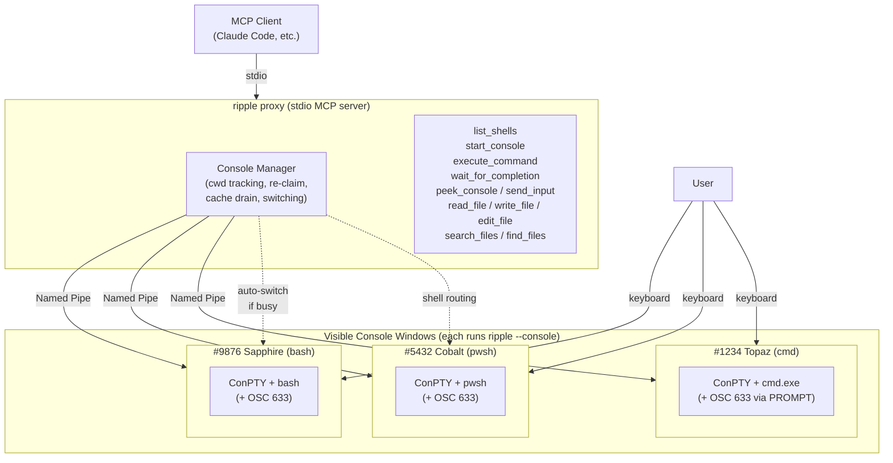

# Ripple — REPL-sharing MCP for AI Co-Driving

<div align="center">
  
</div>

**A REPL-sharing MCP server for AI that actually holds a session.** Shell, Python, Node, a language debugger — whatever you'd open a REPL window for, ripple keeps it live between tool calls. Load `Import-Module Az` once and let AI run 50 follow-up cmdlets in milliseconds each; drop into `pdb` once and let AI step, inspect, and fix without restarting the process. Watch every command happen in a real terminal window — the same one you can type into yourself.

## Install

No runtime prerequisite — ripple ships as a self-contained NativeAOT binary (~13 MB, Windows x64). `npx` fetches it on first run.

```bash
claude mcp add-json ripple -s user '{"command":"npx","args":["-y","@ytsuda/ripple@latest"]}'
```

<details>
<summary>Claude Desktop</summary>

Add to `%APPDATA%\Claude\claude_desktop_config.json`:

```json
{
  "mcpServers": {
    "ripple": {
      "command": "npx",
      "args": ["-y", "@ytsuda/ripple@latest"]
    }
  }
}
```

The `@latest` tag is important: without it, npx will happily keep reusing a stale cached copy even after a new version ships.

</details>

## Why ripple?

ripple gives AI a **stateful and visible** REPL session — the same window you can read along with and type into yourself. That combination unlocks workflows other MCP servers can't support: secrets the AI never sees, full PowerShell module ecosystems, real debugger sessions.

### Sensitive operations stay sensitive

When a command needs a passphrase, MFA code, or other secret — `Read-Host -AsSecureString`, `gpg --sign`, `ssh-add`, `sudo`, cloud CLI MFA prompts — you type it directly into the visible window. The keystrokes go to the running program, not to the terminal output stream the AI sees. The AI orchestrates the workflow ("run the publish build, sign with my key, then push the tag") but never sees the secret itself.

This is impossible with stdin-piped MCP shells, where the AI must somehow supply the secret. Interactive build pipelines that involve code-signing keys, hardware token PINs, or two-factor codes work naturally on ripple — the human stays in the loop only for the moment that requires them, and the AI handles everything around it.

### PowerShell becomes a first-class AI environment

Session persistence helps every shell, but for **PowerShell it's transformative**. Most MCP shell servers spin up a fresh subshell per command — which makes real PowerShell workflows impractical:

- **10,000+ modules on [PowerShell Gallery](https://www.powershellgallery.com/).** Az (Azure), AWS.Tools, Microsoft.Graph (Entra ID / M365), ExchangeOnlineManagement, PnP.PowerShell, SqlServer, ActiveDirectory — plus every CLI in PATH (git, docker, kubectl, terraform, gh, az, aws, gcloud) and full access to .NET types.
- **30–70 second cold imports, paid once.** `Import-Module Az.Compute, Az.Storage, Az.Network` can take over a minute on the first call. A subshell-per-command MCP server pays that cost on *every* command and the AI gives up on Azure workflows entirely. With ripple, the AI imports once and every subsequent cmdlet runs in milliseconds.
- **Live .NET object graphs.** PowerShell pipes rich objects, not text. After `$vms = Get-AzVM -Status`, the AI can chain arbitrary follow-ups against the live object — filter, group, drill into nested properties — without re-hitting Azure. In a one-shot MCP server, that object vanishes the moment the command returns.
- **Interactive build-up of complex work.** Set a variable, inspect it, reshape it, feed it back into the next cmdlet. Build a multi-step workflow one command at a time with every previous step's result still in scope.

```powershell
# Command 1 — cold import, paid once for the whole session
Import-Module Az.Compute, Az.Storage, Az.Network

# Command 2 — instant; capture the result into a variable
$vms = Get-AzVM -Status

# Command 3 — instant; same session, $vms still in scope
$vms | Where-Object PowerState -eq "VM running" |
    Group-Object Location | Sort-Object Count -Descending

# Command 4 — instant; reach into a new service, same session
Get-AzStorageAccount | Where-Object { -not $_.EnableHttpsTrafficOnly }
```

PowerShell on ripple is the difference between **"AI can answer one-off questions"** and **"AI can do real infrastructure work."** bash and cmd are fully supported too, but pwsh is where ripple shines.

### Full transparency, in both directions

ripple opens a **real, visible terminal window**. You see every AI command as it runs — same characters, same output, same prompt — and you can type into the same window yourself at any time. When a command hangs on an interactive prompt, stalls in watch mode, or just needs a Ctrl+C, the AI can read what's currently on the screen and send keystrokes (Enter, y/n, arrow keys, Ctrl+C) back to the running command — diagnosing and responding without human intervention.

## Tools

### Shell tools

| Tool | Description |
|------|-------------|
| `list_shells` | Enumerate every adapter this ripple build accepts as the `shell` argument — shells, REPLs, and debuggers. Each entry reports name, aliases, description, family (`shell` / `repl` / `debugger`), source (embedded vs. external YAML from `~/.ripple/adapters`), and the resolved absolute executable path `start_console` would launch (or a `not found in PATH` note). Also surfaces startup load issues (parse errors, collisions, overrides) so an adapter YAML that silently failed to register is discoverable at runtime. Use before `start_console` to check what is actually available, or when diagnosing why an expected shell name is unrecognized. |
| `start_console` | Open a visible terminal window. Pick any adapter — shells (bash, pwsh, zsh, cmd), REPLs (python, node, racket, ccl, abcl, sbcl, fsi, jshell, groovysh, lua, deno, sqlite3), or debuggers (perldb, jdb, pdb). Optional `cwd`, `banner`, and `reason` parameters. Reuses an existing standby of the same adapter unless `reason` is provided. |
| `execute_command` | Run a pipeline. Optionally specify `shell` to target a specific shell type — finds an existing console of that shell, or auto-starts one. Times out cleanly with output cached for `wait_for_completion`. On timeout, includes a `partialOutput` snapshot so the AI can diagnose stuck commands immediately. |
| `wait_for_completion` | Block until busy consoles finish and retrieve cached output (use after a command times out). |
| `peek_console` | Read-only snapshot of what a console is currently displaying. On Windows, reads the console screen buffer directly (exact match with the visible terminal). On Linux/macOS, uses a built-in VT terminal interpreter as fallback. Specify a console by display name or PID, or omit to peek at the active console. Reports busy/idle state, running command, and elapsed time. |
| `send_input` | Send raw keystrokes to a **busy** console's PTY input. Use `\r` for Enter, `\x03` for Ctrl+C, `\x1b[A` for arrow up, etc. Rejected when the console is idle (use `execute_command` instead). Console must be specified explicitly — no implicit routing, for safety. Max 256 chars per call. |

Status lines include the console name, shell family, exit code, duration, and current directory:

```
✓ #12345 Sapphire (bash) | Status: Completed | Pipeline: ls /tmp | Duration: 0.6s | Location: /tmp
```

### File tools

Claude Code–compatible file primitives (`read_file`, `write_file`, `edit_file`, `search_files`, `find_files`), useful when the MCP client doesn't already provide them.

## Adapters

ripple ships **19 adapters** — 4 shells, 12 language REPLs, 3 debuggers — all defined declaratively in YAML and driven by a shared worker runtime. Start any of them with `start_console shell=<name>`, and the same OSC 633 command-lifecycle tracking, session persistence, cache-on-timeout, and auto-routing apply unchanged.

**Shells (4)** — pwsh / powershell, bash, zsh, cmd

**REPLs (12)**
- **Languages**: Python, Node.js, Deno (TypeScript), Lua
- **Lisp**: Racket, CCL / ABCL / SBCL (Common Lisp)
- **JVM**: jshell (Java), groovysh (Apache Groovy)
- **Other**: F# Interactive (fsi), SQLite3

**Debuggers (3)** — pdb (Python), perldb (Perl `perl -d`), jdb (Java) — driven via a unified `commands.debugger` vocabulary (step_in / step_over / step_out / continue / print / dump / backtrace / source_list / locals / breakpoint_set / ...) so AI agents drive any debugger with the same operation names, regardless of whether the underlying syntax is `s`, `step`, or otherwise.

Adapter framework: see [adapters/SCHEMA.md](adapters/SCHEMA.md). Custom adapters can be dropped into `~/.ripple/adapters/*.yaml`, but the schema is still iterating toward a v1 freeze, so upstreaming additions is the safer path for now.

## Multi-shell behavior

Each console tracks its own cwd. When the active console is busy, the AI is auto-routed to a sibling console of the same shell family — started at the source console's cwd — and its next command runs immediately. Manual `cd` in the terminal is detected and the AI is warned before it runs the wrong command in the wrong place.

### Reliability features

- **Console re-claim**: consoles outlive their parent MCP process — AI client restarts don't kill loaded modules or variables
- **Cwd drift detection**: a manual `cd` in the terminal triggers a verification warning before the AI runs in the wrong place
- **Sub-agent isolation**: parallel AI agents get their own consoles, no cross-contamination
- **Multi-line PowerShell**: heredocs, `foreach`, `try`/`catch`, nested scriptblocks all work via tempfile dot-sourcing

<details>
<summary>Full routing matrix</summary>

| Scenario | Behavior |
|---|---|
| First execute on a new shell | Auto-starts a console; warns so you can verify cwd before re-executing |
| Active console matches requested shell | Runs immediately |
| Active console busy, same shell requested | Auto-starts a sibling console **at the source console's cwd** and runs immediately |
| Switch to a same-shell standby | Runs a standalone `cd` first (with an explicit failure check against the expected directory) so the command runs in the source cwd, then executes the AI's pipeline unchanged |
| Switch to a different shell | Warns to confirm cwd (cross-shell path translation is not implemented) |
| User manually `cd`'d in the active console | Warns so the AI can verify the new cwd before running its next command |

</details>

## How it works

ripple runs as a stdio MCP server. When the AI calls `start_console`, ripple spawns itself in `--console` mode as a ConPTY worker, which hosts the actual shell (cmd.exe, pwsh.exe, bash.exe) inside a real Windows console window. The parent process streams stdin/stdout over a named pipe, injects [OSC 633 shell integration](https://code.visualstudio.com/docs/terminal/shell-integration) scripts (the same protocol VS Code uses) to emit explicit command-lifecycle markers, and parses those markers to delimit command output, track cwd, and capture exit codes — no output-silence heuristics, no prompt-string detection.

<details>
<summary>Architecture diagram</summary>



</details>

## Build from source

```bash
git clone https://github.com/yotsuda/ripple.git
cd ripple
dotnet publish -c Release -r win-x64 -o ./dist
```

The csproj has `PublishAot=true`, so the published binary is a NativeAOT single-exe with no .NET runtime dependency. The binary is `./dist/ripple.exe` (~13 MB) — use the absolute path instead of the `npx` command in your MCP config.

## Platform support

**Windows** is the primary target (ConPTY + Named Pipe, fully tested).

**Linux / macOS** are functional through the same adapter framework, using forkpty via `posix_spawn` + `POSIX_SPAWN_SETSID` and opening a visible terminal window through `$TERMINAL` (then `gnome-terminal` / `konsole` / `xfce4-terminal` / `mate-terminal` / `alacritty` / `kitty` / `foot` / `xterm` in turn) on Linux and `Terminal.app` on macOS. `start_console` and `execute_command` against bash, pwsh, and python round-trip cleanly; shell integration (OSC 633) fires on all three. See the limitations below for the outstanding interactive-rendering gaps.

## Debugging

Each ripple worker process writes a per-session log to
`%TEMP%\ripple-worker-{PID}.log` on Windows (or the equivalent temp
directory on Unix). It captures raw PTY bytes during AI commands,
adapter-level events (OSC markers, regex prompt matches, continuation
escapes), and every `send_input` call — enough to reconstruct what the
shell saw and what ripple did in response. The PID in the filename
matches the number in console display names (e.g. `#41456 Peony` →
`ripple-worker-41456.log`), so if a specific console misbehaves you
can read its log directly.

For adapter work there are also two CLI modes that run without an MCP
client: `ripple --list-adapters` prints the registry state, and
`ripple --adapter-tests` runs each adapter's declared contract tests
against the real interpreter.

## Known limitations

- **cmd.exe exit codes always read as 0** — cmd's `PROMPT` can't expand `%ERRORLEVEL%` at display time, so AI commands show as `Finished (exit code unavailable)`. Use `pwsh` or `bash` for exit-code-aware work.
- **Don't `Remove-Module PSReadLine -Force` inside a pwsh session** — PSReadLine's background reader threads survive module unload and steal console input, hanging the next AI command. Not recoverable.
- **Linux / macOS: interactive rendering after AI commands can drift.** On Unix there's no in-process virtual terminal emulator between ripple and the hosted shell — the relay is byte-level. DSR cursor-position replies are fabricated from the adapter's known prompt shape, which is accurate enough that shells accept typed input and AI commands capture output correctly (matrix passes for bash / pwsh / python) but not precise enough to keep PSReadLine's history recall or bash readline's prompt redraw fully aligned with the physical cursor after large outputs. A full VT emulator layer is tracked as future work.

## Migration

Renamed from `splash` at v0.8.0. The project shipped as `splashshell` on npm for v0.1.0–v0.5.0, was renamed to `@ytsuda/splash` for v0.7.0, and renamed again to `@ytsuda/ripple` starting with v0.8.0 once the adapter framework grew past shells into any REPL. `@ytsuda/splash` and `splashshell` are both deprecated; uninstall them and install `@ytsuda/ripple` to keep receiving updates. The GitHub repo moved from `yotsuda/splash` to `yotsuda/ripple`; GitHub redirects old clone URLs automatically.

## License

MIT. Release notes in [CHANGELOG.md](CHANGELOG.md).
